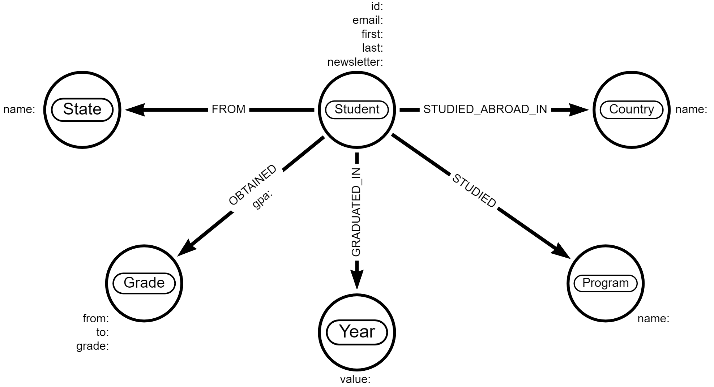

# Introduction to Neo4j
This is the repository for the LinkedIn Learning course `Introduction to Neo4j`. The full course is available from [LinkedIn Learning][lil-course-url].

## Instructions
All instructions and commands used in this course are available in this repository for easy copy-paste access, along with the course dataset and load script. You do not require a copy of this repository or any content within it.

## Supporting course content

### The Roux Academy data model

### 2. Getting started
* [Hello, world!][02_03]
* [Chapter solution][02_06]

### 3. Reading data
* [Introducing the course dataset][03_01]
* [MATCHing nodes][03_02]
* [MATCHing nodes and relationships][03_03]
* [Counting and aggregating data][03_04]
* [Beyond one hop][03_05]
* [Chapter solution][03_07]

### 4. Writing data
* [CREATEing your data][04_01]
* [Updating and REMOVEing your data][04_02]
* [DELETEing your data][04_03]
* [Chapter solution][04_05]

[0]: # (Replace these placeholder URLs with actual course URLs)

[lil-course-url]: https://www.linkedin.com/learning/
[lil-thumbnail-url]: http://
[02_03]: https://raw.githubusercontent.com/LinkedInLearning/learning-neo4j-2483130/main/course_material/02_03.txt
[02_06]:https://raw.githubusercontent.com/LinkedInLearning/learning-neo4j-2483130/main/course_material/02_06.txt
[03_01]: https://raw.githubusercontent.com/LinkedInLearning/learning-neo4j-2483130/main/course_material/03_01.txt
[03_02]: https://raw.githubusercontent.com/LinkedInLearning/learning-neo4j-2483130/main/course_material/03_02.txt
[03_03]: https://raw.githubusercontent.com/LinkedInLearning/learning-neo4j-2483130/main/course_material/03_03.txt
[03_04]: https://raw.githubusercontent.com/LinkedInLearning/learning-neo4j-2483130/main/course_material/03_04.txt
[03_05]: https://raw.githubusercontent.com/LinkedInLearning/learning-neo4j-2483130/main/course_material/03_05.txt
[03_07]: https://raw.githubusercontent.com/LinkedInLearning/learning-neo4j-2483130/main/course_material/03_07.txt
[04_01]: https://raw.githubusercontent.com/LinkedInLearning/learning-neo4j-2483130/main/course_material/04_01.txt
[04_02]: https://raw.githubusercontent.com/LinkedInLearning/learning-neo4j-2483130/main/course_material/04_02.txt
[04_03]: https://raw.githubusercontent.com/LinkedInLearning/learning-neo4j-2483130/main/course_material/04_03.txt
[04_05]: https://raw.githubusercontent.com/LinkedInLearning/learning-neo4j-2483130/main/course_material/04_05.txt
